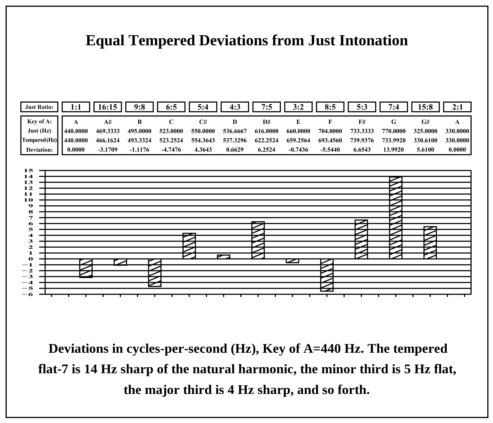

# Derivation of a Scale

Here we'll be walking through the process of creating a 12 tone chromatic scale using the harmonic series, and combinations and inversions thereof. This is essentially an abridged version of a better explanation from the book "The Story of Harmony" by Rex Weyler and Bill Gannon

------------------------------------------------------------------

>The phenomenon of harmony - or resonance, or sympathetic vibration - is not a human construct, but is rather a natural relationship between vibrating bodies in the real world.  

-- Weyler and Gannon, *The Story of Harmony*

A few quick notes:

- A **harmonic** of a pitch is a frequency with a whole number ratio to that pitch. 
- Division of pitch space into octaves is a convention, not a law. One could just as easily use a ratio of 3:1 or 5:1. But we won't be bothering with that right now.
- An **overtone** is any resonant frequency above a given pitch. All harmonics are overtones, but not all overtones are harmonics.

------------------------------------------------------------------

If you take the first 15 of the harmonic series and ignore octave duplicates and quarter tones, you are left with the **chromatic harmonic set:**

|     Ratio    |  1:1  |  9:8  |  5:4  |  3:2  |  7:4  | 15:8  |
|--------------|-------|-------|-------|-------|-------|-------|
| Scale degree |   1   |   2   |   3   |   3   |   7b  |   7   |

By taking inversions of some of these ratios, we can fill in some gaps to make the 9 tone Justonic **Inversion Harmonic Scale** (Weyler & Gannon pp. 126-127):

| Ratio        | 1:1 | 16:5 | 9:8 | 5:4 | 4:3 | 3:2 | 8:5 | 7:4 | 15:8 |
|--------------|-----|------|-----|-----|-----|-----|-----|-----|------|
| Scale degree | 1   | 1#   | 2   | 3   | 4   | 5   | 6b  | 7b  | 7    |

For the rest of the gaps we can use combination tones of the pitches we already have, except for the tritone, for which Weyler & Gannon recommend 7:5, the minor sixth of the flat seven (7:4 * 8:5 * 1:2 = 7:5). Now behold the Justonic classic **Harmonic Chromatic Scale:**

| Ratio        | 1:1 | 16:5 | 9:8 | 6:5 | 5:4 | 4:3 | 7:5 | 3:2 | 8:5 | 5:3 | 7:4 | 15:8 |
|--------------|-----|------|-----|-----|-----|-----|-----|-----|-----|-----|-----|------|
| Scale degree | 1   | 1#   | 2   | 3b  | 3   | 4   | 4#  | 5   | 6b  | 6   | 7b  | 7    |

